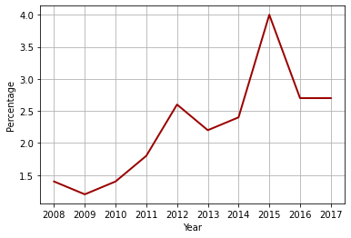

# Analysis of Reoffenders in NSW

Python code to analyze reoffenders in NSW based on data the NSW Reoffendng Database from the NSW Bureau of Crime Statistics and Research.

# Loading libraries

Let's load relevant Python libraries.


```python
import numpy as np 
import pandas as pd 
import seaborn as sns
import plotly.express as px
from plotly import graph_objects as go
import matplotlib.pyplot as plt 
from matplotlib.ticker import MaxNLocator
from IPython.display import display, Markdown
import matplotlib as mpl
import warnings
warnings.filterwarnings("ignore")
```

# Loading data

The dataset was acquired from the NSW Bureau of Crime Statistics and Research. 


```python
filename = 'Reoffending in NSW.xlsx';
data = pd.ExcelFile(filename)
```

Let's list the sheets.


```python
data.sheet_names
```


    ['Table 1', 'Table 2', 'Table 3', 'Table 4']


# Analysis of reoffenders without imprisonment

Let's analyze people reoffending within 12 months with proven prior finalised court appearances, completed Youth Justice Conferences, or received a penalty other than prison.


```python
data = pd.read_excel(filename, 'Table 1')
data.head(10)
```


<div>
<table border="1" class="dataframe">
  <thead>
    <tr style="text-align: right;">
      <th></th>
      <th>NSW Reoffending Database 2000 to 2018</th>
      <th>Unnamed: 1</th>
      <th>Unnamed: 2</th>
      <th>Unnamed: 3</th>
      <th>Unnamed: 4</th>
      <th>Unnamed: 5</th>
      <th>Unnamed: 6</th>
      <th>Unnamed: 7</th>
      <th>Unnamed: 8</th>
      <th>Unnamed: 9</th>
      <th>...</th>
      <th>Unnamed: 11</th>
      <th>Unnamed: 12</th>
      <th>Unnamed: 13</th>
      <th>Unnamed: 14</th>
      <th>Unnamed: 15</th>
      <th>Unnamed: 16</th>
      <th>Unnamed: 17</th>
      <th>Unnamed: 18</th>
      <th>Unnamed: 19</th>
      <th>Unnamed: 20</th>
    </tr>
  </thead>
  <tbody>
    <tr>
      <th>0</th>
      <td>NaN</td>
      <td>NaN</td>
      <td>NaN</td>
      <td>NaN</td>
      <td>NaN</td>
      <td>NaN</td>
      <td>NaN</td>
      <td>NaN</td>
      <td>NaN</td>
      <td>NaN</td>
      <td>...</td>
      <td>NaN</td>
      <td>NaN</td>
      <td>NaN</td>
      <td>NaN</td>
      <td>NaN</td>
      <td>NaN</td>
      <td>NaN</td>
      <td>NaN</td>
      <td>NaN</td>
      <td>NaN</td>
    </tr>
    <tr>
      <th>1</th>
      <td>People with proven finalised court appearances...</td>
      <td>NaN</td>
      <td>NaN</td>
      <td>NaN</td>
      <td>NaN</td>
      <td>NaN</td>
      <td>NaN</td>
      <td>NaN</td>
      <td>NaN</td>
      <td>NaN</td>
      <td>...</td>
      <td>NaN</td>
      <td>NaN</td>
      <td>NaN</td>
      <td>NaN</td>
      <td>NaN</td>
      <td>NaN</td>
      <td>NaN</td>
      <td>NaN</td>
      <td>NaN</td>
      <td>NaN</td>
    </tr>
    <tr>
      <th>2</th>
      <td>Percentage re-offending within 12 months</td>
      <td>NaN</td>
      <td>NaN</td>
      <td>NaN</td>
      <td>NaN</td>
      <td>NaN</td>
      <td>NaN</td>
      <td>NaN</td>
      <td>NaN</td>
      <td>NaN</td>
      <td>...</td>
      <td>NaN</td>
      <td>NaN</td>
      <td>NaN</td>
      <td>NaN</td>
      <td>NaN</td>
      <td>NaN</td>
      <td>NaN</td>
      <td>NaN</td>
      <td>NaN</td>
      <td>NaN</td>
    </tr>
    <tr>
      <th>3</th>
      <td>By adult &amp; juvenile, gender, age at reference ...</td>
      <td>NaN</td>
      <td>NaN</td>
      <td>NaN</td>
      <td>NaN</td>
      <td>NaN</td>
      <td>NaN</td>
      <td>NaN</td>
      <td>NaN</td>
      <td>NaN</td>
      <td>...</td>
      <td>NaN</td>
      <td>NaN</td>
      <td>NaN</td>
      <td>NaN</td>
      <td>NaN</td>
      <td>NaN</td>
      <td>NaN</td>
      <td>NaN</td>
      <td>NaN</td>
      <td>NaN</td>
    </tr>
    <tr>
      <th>4</th>
      <td>NaN</td>
      <td>NaN</td>
      <td>NaN</td>
      <td>NaN</td>
      <td>NaN</td>
      <td>NaN</td>
      <td>NaN</td>
      <td>NaN</td>
      <td>NaN</td>
      <td>NaN</td>
      <td>...</td>
      <td>NaN</td>
      <td>NaN</td>
      <td>NaN</td>
      <td>NaN</td>
      <td>NaN</td>
      <td>NaN</td>
      <td>NaN</td>
      <td>NaN</td>
      <td>NaN</td>
      <td>NaN</td>
    </tr>
    <tr>
      <th>5</th>
      <td>NaN</td>
      <td>NaN</td>
      <td>NaN</td>
      <td>2000.0</td>
      <td>2001.0</td>
      <td>2002.0</td>
      <td>2003.0</td>
      <td>2004.0</td>
      <td>2005.0</td>
      <td>2006.0</td>
      <td>...</td>
      <td>2008.0</td>
      <td>2009.0</td>
      <td>2010.0</td>
      <td>2011.0</td>
      <td>2012.0</td>
      <td>2013.0</td>
      <td>2014.0</td>
      <td>2015.0</td>
      <td>2016.0</td>
      <td>2017.0</td>
    </tr>
    <tr>
      <th>6</th>
      <td>Cohort group</td>
      <td>Gender</td>
      <td>NaN</td>
      <td>2238.0</td>
      <td>2398.0</td>
      <td>2366.0</td>
      <td>2230.0</td>
      <td>2446.0</td>
      <td>2449.0</td>
      <td>2460.0</td>
      <td>...</td>
      <td>2686.0</td>
      <td>2585.0</td>
      <td>2339.0</td>
      <td>2177.0</td>
      <td>2271.0</td>
      <td>2490.0</td>
      <td>2640.0</td>
      <td>3160.0</td>
      <td>3530.0</td>
      <td>3727.0</td>
    </tr>
    <tr>
      <th>7</th>
      <td>Adults in Local or Higher Court appearances</td>
      <td>Female</td>
      <td>No.</td>
      <td>NaN</td>
      <td>NaN</td>
      <td>NaN</td>
      <td>NaN</td>
      <td>NaN</td>
      <td>NaN</td>
      <td>NaN</td>
      <td>...</td>
      <td>NaN</td>
      <td>NaN</td>
      <td>NaN</td>
      <td>NaN</td>
      <td>NaN</td>
      <td>NaN</td>
      <td>NaN</td>
      <td>NaN</td>
      <td>NaN</td>
      <td>NaN</td>
    </tr>
    <tr>
      <th>8</th>
      <td>NaN</td>
      <td>NaN</td>
      <td>%</td>
      <td>16.5</td>
      <td>16.2</td>
      <td>15.6</td>
      <td>14.0</td>
      <td>14.9</td>
      <td>14.0</td>
      <td>14.3</td>
      <td>...</td>
      <td>14.2</td>
      <td>13.2</td>
      <td>12.7</td>
      <td>12.5</td>
      <td>14.2</td>
      <td>15.3</td>
      <td>15.7</td>
      <td>18.1</td>
      <td>18.8</td>
      <td>18.9</td>
    </tr>
    <tr>
      <th>9</th>
      <td>NaN</td>
      <td>Male</td>
      <td>No.</td>
      <td>12659.0</td>
      <td>13152.0</td>
      <td>12886.0</td>
      <td>12492.0</td>
      <td>13205.0</td>
      <td>12990.0</td>
      <td>12658.0</td>
      <td>...</td>
      <td>13072.0</td>
      <td>12464.0</td>
      <td>11399.0</td>
      <td>10966.0</td>
      <td>11049.0</td>
      <td>11400.0</td>
      <td>12197.0</td>
      <td>13737.0</td>
      <td>14529.0</td>
      <td>14595.0</td>
    </tr>
  </tbody>
</table>
<p>10 rows × 21 columns</p>
</div>


The first 6 rows need to be skipped because they are part of a header.


```python
data.tail(12)
```


<div>
<table border="1" class="dataframe">
  <thead>
    <tr style="text-align: right;">
      <th></th>
      <th>NSW Reoffending Database 2000 to 2018</th>
      <th>Unnamed: 1</th>
      <th>Unnamed: 2</th>
      <th>Unnamed: 3</th>
      <th>Unnamed: 4</th>
      <th>Unnamed: 5</th>
      <th>Unnamed: 6</th>
      <th>Unnamed: 7</th>
      <th>Unnamed: 8</th>
      <th>Unnamed: 9</th>
      <th>...</th>
      <th>Unnamed: 11</th>
      <th>Unnamed: 12</th>
      <th>Unnamed: 13</th>
      <th>Unnamed: 14</th>
      <th>Unnamed: 15</th>
      <th>Unnamed: 16</th>
      <th>Unnamed: 17</th>
      <th>Unnamed: 18</th>
      <th>Unnamed: 19</th>
      <th>Unnamed: 20</th>
    </tr>
  </thead>
  <tbody>
    <tr>
      <th>49</th>
      <td>NaN</td>
      <td>Offenders</td>
      <td>No.</td>
      <td>4332.0</td>
      <td>3900.0</td>
      <td>3780.0</td>
      <td>3616.0</td>
      <td>3920.0</td>
      <td>3978.0</td>
      <td>4268.0</td>
      <td>...</td>
      <td>4799.0</td>
      <td>4878.0</td>
      <td>4683.0</td>
      <td>4423.0</td>
      <td>4081.0</td>
      <td>3793.0</td>
      <td>3297.0</td>
      <td>3461.0</td>
      <td>3265.0</td>
      <td>3138.0</td>
    </tr>
    <tr>
      <th>50</th>
      <td>NaN</td>
      <td>NaN</td>
      <td>NaN</td>
      <td>NaN</td>
      <td>NaN</td>
      <td>NaN</td>
      <td>NaN</td>
      <td>NaN</td>
      <td>NaN</td>
      <td>NaN</td>
      <td>...</td>
      <td>NaN</td>
      <td>NaN</td>
      <td>NaN</td>
      <td>NaN</td>
      <td>NaN</td>
      <td>NaN</td>
      <td>NaN</td>
      <td>NaN</td>
      <td>NaN</td>
      <td>NaN</td>
    </tr>
    <tr>
      <th>51</th>
      <td>Notes</td>
      <td>NaN</td>
      <td>NaN</td>
      <td>NaN</td>
      <td>NaN</td>
      <td>NaN</td>
      <td>NaN</td>
      <td>NaN</td>
      <td>NaN</td>
      <td>NaN</td>
      <td>...</td>
      <td>NaN</td>
      <td>NaN</td>
      <td>NaN</td>
      <td>NaN</td>
      <td>NaN</td>
      <td>NaN</td>
      <td>NaN</td>
      <td>NaN</td>
      <td>NaN</td>
      <td>NaN</td>
    </tr>
    <tr>
      <th>52</th>
      <td>1. Re-offending is any proven offence occurrin...</td>
      <td>NaN</td>
      <td>NaN</td>
      <td>NaN</td>
      <td>NaN</td>
      <td>NaN</td>
      <td>NaN</td>
      <td>NaN</td>
      <td>NaN</td>
      <td>NaN</td>
      <td>...</td>
      <td>NaN</td>
      <td>NaN</td>
      <td>NaN</td>
      <td>NaN</td>
      <td>NaN</td>
      <td>NaN</td>
      <td>NaN</td>
      <td>NaN</td>
      <td>NaN</td>
      <td>NaN</td>
    </tr>
    <tr>
      <th>53</th>
      <td>2. Age is as at finalisation of the reference ...</td>
      <td>NaN</td>
      <td>NaN</td>
      <td>NaN</td>
      <td>NaN</td>
      <td>NaN</td>
      <td>NaN</td>
      <td>NaN</td>
      <td>NaN</td>
      <td>NaN</td>
      <td>...</td>
      <td>NaN</td>
      <td>NaN</td>
      <td>NaN</td>
      <td>NaN</td>
      <td>NaN</td>
      <td>NaN</td>
      <td>NaN</td>
      <td>NaN</td>
      <td>NaN</td>
      <td>NaN</td>
    </tr>
    <tr>
      <th>54</th>
      <td>3. The earliest appearence or conference or ca...</td>
      <td>NaN</td>
      <td>NaN</td>
      <td>NaN</td>
      <td>NaN</td>
      <td>NaN</td>
      <td>NaN</td>
      <td>NaN</td>
      <td>NaN</td>
      <td>NaN</td>
      <td>...</td>
      <td>NaN</td>
      <td>NaN</td>
      <td>NaN</td>
      <td>NaN</td>
      <td>NaN</td>
      <td>NaN</td>
      <td>NaN</td>
      <td>NaN</td>
      <td>NaN</td>
      <td>NaN</td>
    </tr>
    <tr>
      <th>55</th>
      <td>Source: NSW Bureau of Crime Statistics and Res...</td>
      <td>NaN</td>
      <td>NaN</td>
      <td>NaN</td>
      <td>NaN</td>
      <td>NaN</td>
      <td>NaN</td>
      <td>NaN</td>
      <td>NaN</td>
      <td>NaN</td>
      <td>...</td>
      <td>NaN</td>
      <td>NaN</td>
      <td>NaN</td>
      <td>NaN</td>
      <td>NaN</td>
      <td>NaN</td>
      <td>NaN</td>
      <td>NaN</td>
      <td>NaN</td>
      <td>NaN</td>
    </tr>
    <tr>
      <th>56</th>
      <td>Please retain this reference number for future...</td>
      <td>NaN</td>
      <td>NaN</td>
      <td>NaN</td>
      <td>NaN</td>
      <td>NaN</td>
      <td>NaN</td>
      <td>NaN</td>
      <td>NaN</td>
      <td>NaN</td>
      <td>...</td>
      <td>NaN</td>
      <td>NaN</td>
      <td>NaN</td>
      <td>NaN</td>
      <td>NaN</td>
      <td>NaN</td>
      <td>NaN</td>
      <td>NaN</td>
      <td>NaN</td>
      <td>NaN</td>
    </tr>
    <tr>
      <th>57</th>
      <td>NaN</td>
      <td>NaN</td>
      <td>NaN</td>
      <td>NaN</td>
      <td>NaN</td>
      <td>NaN</td>
      <td>NaN</td>
      <td>NaN</td>
      <td>NaN</td>
      <td>NaN</td>
      <td>...</td>
      <td>NaN</td>
      <td>NaN</td>
      <td>NaN</td>
      <td>NaN</td>
      <td>NaN</td>
      <td>NaN</td>
      <td>NaN</td>
      <td>NaN</td>
      <td>NaN</td>
      <td>NaN</td>
    </tr>
    <tr>
      <th>58</th>
      <td>NOTE: Data sourced from the NSW Bureau of Crim...</td>
      <td>NaN</td>
      <td>NaN</td>
      <td>NaN</td>
      <td>NaN</td>
      <td>NaN</td>
      <td>NaN</td>
      <td>NaN</td>
      <td>NaN</td>
      <td>NaN</td>
      <td>...</td>
      <td>NaN</td>
      <td>NaN</td>
      <td>NaN</td>
      <td>NaN</td>
      <td>NaN</td>
      <td>NaN</td>
      <td>NaN</td>
      <td>NaN</td>
      <td>NaN</td>
      <td>NaN</td>
    </tr>
    <tr>
      <th>59</th>
      <td>Must be acknowledged in any document (electron...</td>
      <td>NaN</td>
      <td>NaN</td>
      <td>NaN</td>
      <td>NaN</td>
      <td>NaN</td>
      <td>NaN</td>
      <td>NaN</td>
      <td>NaN</td>
      <td>NaN</td>
      <td>...</td>
      <td>NaN</td>
      <td>NaN</td>
      <td>NaN</td>
      <td>NaN</td>
      <td>NaN</td>
      <td>NaN</td>
      <td>NaN</td>
      <td>NaN</td>
      <td>NaN</td>
      <td>NaN</td>
    </tr>
    <tr>
      <th>60</th>
      <td>The acknowledgement should take the form of 'S...</td>
      <td>NaN</td>
      <td>NaN</td>
      <td>NaN</td>
      <td>NaN</td>
      <td>NaN</td>
      <td>NaN</td>
      <td>NaN</td>
      <td>NaN</td>
      <td>NaN</td>
      <td>...</td>
      <td>NaN</td>
      <td>NaN</td>
      <td>NaN</td>
      <td>NaN</td>
      <td>NaN</td>
      <td>NaN</td>
      <td>NaN</td>
      <td>NaN</td>
      <td>NaN</td>
      <td>NaN</td>
    </tr>
  </tbody>
</table>
<p>12 rows × 21 columns</p>
</div>


The last 11 rows need to be skipped.


```python
data = pd.read_excel(filename, 'Table 1', skiprows=6, skipfooter=11)
data.rename(columns={'Unnamed: 0' : '', 'Unnamed: 1' : ' '}, inplace=True)
```


```python
data.head()
```


<div>
<table border="1" class="dataframe">
  <thead>
    <tr style="text-align: right;">
      <th></th>
      <th></th>
      <th></th>
      <th>Unnamed: 2</th>
      <th>2000</th>
      <th>2001</th>
      <th>2002</th>
      <th>2003</th>
      <th>2004</th>
      <th>2005</th>
      <th>2006</th>
      <th>...</th>
      <th>2008</th>
      <th>2009</th>
      <th>2010</th>
      <th>2011</th>
      <th>2012</th>
      <th>2013</th>
      <th>2014</th>
      <th>2015</th>
      <th>2016</th>
      <th>2017</th>
    </tr>
  </thead>
  <tbody>
    <tr>
      <th>0</th>
      <td>Cohort group</td>
      <td>Gender</td>
      <td>NaN</td>
      <td>2238.0</td>
      <td>2398.0</td>
      <td>2366.0</td>
      <td>2230.0</td>
      <td>2446.0</td>
      <td>2449.0</td>
      <td>2460.0</td>
      <td>...</td>
      <td>2686.0</td>
      <td>2585.0</td>
      <td>2339.0</td>
      <td>2177.0</td>
      <td>2271.0</td>
      <td>2490.0</td>
      <td>2640.0</td>
      <td>3160.0</td>
      <td>3530.0</td>
      <td>3727.0</td>
    </tr>
    <tr>
      <th>1</th>
      <td>Adults in Local or Higher Court appearances</td>
      <td>Female</td>
      <td>No.</td>
      <td>NaN</td>
      <td>NaN</td>
      <td>NaN</td>
      <td>NaN</td>
      <td>NaN</td>
      <td>NaN</td>
      <td>NaN</td>
      <td>...</td>
      <td>NaN</td>
      <td>NaN</td>
      <td>NaN</td>
      <td>NaN</td>
      <td>NaN</td>
      <td>NaN</td>
      <td>NaN</td>
      <td>NaN</td>
      <td>NaN</td>
      <td>NaN</td>
    </tr>
    <tr>
      <th>2</th>
      <td>NaN</td>
      <td>NaN</td>
      <td>%</td>
      <td>16.5</td>
      <td>16.2</td>
      <td>15.6</td>
      <td>14.0</td>
      <td>14.9</td>
      <td>14.0</td>
      <td>14.3</td>
      <td>...</td>
      <td>14.2</td>
      <td>13.2</td>
      <td>12.7</td>
      <td>12.5</td>
      <td>14.2</td>
      <td>15.3</td>
      <td>15.7</td>
      <td>18.1</td>
      <td>18.8</td>
      <td>18.9</td>
    </tr>
    <tr>
      <th>3</th>
      <td>NaN</td>
      <td>Male</td>
      <td>No.</td>
      <td>12659.0</td>
      <td>13152.0</td>
      <td>12886.0</td>
      <td>12492.0</td>
      <td>13205.0</td>
      <td>12990.0</td>
      <td>12658.0</td>
      <td>...</td>
      <td>13072.0</td>
      <td>12464.0</td>
      <td>11399.0</td>
      <td>10966.0</td>
      <td>11049.0</td>
      <td>11400.0</td>
      <td>12197.0</td>
      <td>13737.0</td>
      <td>14529.0</td>
      <td>14595.0</td>
    </tr>
    <tr>
      <th>4</th>
      <td>NaN</td>
      <td>NaN</td>
      <td>%</td>
      <td>20.5</td>
      <td>19.9</td>
      <td>19.8</td>
      <td>18.3</td>
      <td>19.0</td>
      <td>18.1</td>
      <td>18.4</td>
      <td>...</td>
      <td>18.4</td>
      <td>17.0</td>
      <td>16.7</td>
      <td>16.8</td>
      <td>18.2</td>
      <td>18.8</td>
      <td>19.3</td>
      <td>20.9</td>
      <td>21.4</td>
      <td>21.1</td>
    </tr>
  </tbody>
</table>
<p>5 rows × 21 columns</p>
</div>


Let's fill up NaN values of the first columns with their preceeding values.


```python
for i in range(1, len(data)):
    if str(data[''][i])=='nan':
        data[''][i] = data[''][i-1]
    if str(data[' '][i])=='nan':
        data[' '][i] = data[' '][i-1]    
    if data[''][i].startswith('Adults'):
        data[''][i]='Adults'
    if data[''][i].startswith('Juveniles'):
        data[''][i]='Juveniles'
    if data[' '][i].startswith('Proportion'):
        data[' '][i] = 'Average'
data = data.reset_index(drop=True)
data.head()
```


<div>
<table border="1" class="dataframe">
  <thead>
    <tr style="text-align: right;">
      <th></th>
      <th></th>
      <th></th>
      <th>Unnamed: 2</th>
      <th>2000</th>
      <th>2001</th>
      <th>2002</th>
      <th>2003</th>
      <th>2004</th>
      <th>2005</th>
      <th>2006</th>
      <th>...</th>
      <th>2008</th>
      <th>2009</th>
      <th>2010</th>
      <th>2011</th>
      <th>2012</th>
      <th>2013</th>
      <th>2014</th>
      <th>2015</th>
      <th>2016</th>
      <th>2017</th>
    </tr>
  </thead>
  <tbody>
    <tr>
      <th>0</th>
      <td>Cohort group</td>
      <td>Gender</td>
      <td>NaN</td>
      <td>2238.0</td>
      <td>2398.0</td>
      <td>2366.0</td>
      <td>2230.0</td>
      <td>2446.0</td>
      <td>2449.0</td>
      <td>2460.0</td>
      <td>...</td>
      <td>2686.0</td>
      <td>2585.0</td>
      <td>2339.0</td>
      <td>2177.0</td>
      <td>2271.0</td>
      <td>2490.0</td>
      <td>2640.0</td>
      <td>3160.0</td>
      <td>3530.0</td>
      <td>3727.0</td>
    </tr>
    <tr>
      <th>1</th>
      <td>Adults</td>
      <td>Female</td>
      <td>No.</td>
      <td>NaN</td>
      <td>NaN</td>
      <td>NaN</td>
      <td>NaN</td>
      <td>NaN</td>
      <td>NaN</td>
      <td>NaN</td>
      <td>...</td>
      <td>NaN</td>
      <td>NaN</td>
      <td>NaN</td>
      <td>NaN</td>
      <td>NaN</td>
      <td>NaN</td>
      <td>NaN</td>
      <td>NaN</td>
      <td>NaN</td>
      <td>NaN</td>
    </tr>
    <tr>
      <th>2</th>
      <td>Adults</td>
      <td>Female</td>
      <td>%</td>
      <td>16.5</td>
      <td>16.2</td>
      <td>15.6</td>
      <td>14.0</td>
      <td>14.9</td>
      <td>14.0</td>
      <td>14.3</td>
      <td>...</td>
      <td>14.2</td>
      <td>13.2</td>
      <td>12.7</td>
      <td>12.5</td>
      <td>14.2</td>
      <td>15.3</td>
      <td>15.7</td>
      <td>18.1</td>
      <td>18.8</td>
      <td>18.9</td>
    </tr>
    <tr>
      <th>3</th>
      <td>Adults</td>
      <td>Male</td>
      <td>No.</td>
      <td>12659.0</td>
      <td>13152.0</td>
      <td>12886.0</td>
      <td>12492.0</td>
      <td>13205.0</td>
      <td>12990.0</td>
      <td>12658.0</td>
      <td>...</td>
      <td>13072.0</td>
      <td>12464.0</td>
      <td>11399.0</td>
      <td>10966.0</td>
      <td>11049.0</td>
      <td>11400.0</td>
      <td>12197.0</td>
      <td>13737.0</td>
      <td>14529.0</td>
      <td>14595.0</td>
    </tr>
    <tr>
      <th>4</th>
      <td>Adults</td>
      <td>Male</td>
      <td>%</td>
      <td>20.5</td>
      <td>19.9</td>
      <td>19.8</td>
      <td>18.3</td>
      <td>19.0</td>
      <td>18.1</td>
      <td>18.4</td>
      <td>...</td>
      <td>18.4</td>
      <td>17.0</td>
      <td>16.7</td>
      <td>16.8</td>
      <td>18.2</td>
      <td>18.8</td>
      <td>19.3</td>
      <td>20.9</td>
      <td>21.4</td>
      <td>21.1</td>
    </tr>
  </tbody>
</table>
<p>5 rows × 21 columns</p>
</div>


We are only interested in percentage values since absolute values do not convey a lot of information. 


```python
data = data[data['Unnamed: 2']=='%']
data.drop(['Unnamed: 2'], axis=1, inplace=True)
data = data.reset_index(drop=True)
data = data.set_index(['', ' ']).T
```


```python
data.head()
```


<div>
<table border="1" class="dataframe">
  <thead>
    <tr>
      <th></th>
      <th colspan="10" halign="left">Adults</th>
      <th colspan="8" halign="left">Juveniles</th>
    </tr>
    <tr>
      <th></th>
      <th>Female</th>
      <th>Male</th>
      <th>18 to 24</th>
      <th>25 to 34</th>
      <th>35 to 44</th>
      <th>45 and over</th>
      <th>Indigenous</th>
      <th>Non-Indigenous</th>
      <th>Unknown</th>
      <th>Average</th>
      <th>Female</th>
      <th>Male</th>
      <th>10 to 13</th>
      <th>14 to 17</th>
      <th>Indigenous</th>
      <th>Non-Indigenous</th>
      <th>Unknown</th>
      <th>Average</th>
    </tr>
  </thead>
  <tbody>
    <tr>
      <th>2000</th>
      <td>16.5</td>
      <td>20.5</td>
      <td>24.4</td>
      <td>21.6</td>
      <td>16.3</td>
      <td>9.0</td>
      <td>33.8</td>
      <td>20.0</td>
      <td>13.7</td>
      <td>19.8</td>
      <td>29.4</td>
      <td>42.2</td>
      <td>53.5</td>
      <td>39.2</td>
      <td>53.6</td>
      <td>42.0</td>
      <td>33.3</td>
      <td>40.0</td>
    </tr>
    <tr>
      <th>2001</th>
      <td>16.2</td>
      <td>19.9</td>
      <td>23.4</td>
      <td>21.4</td>
      <td>16.5</td>
      <td>8.6</td>
      <td>32.9</td>
      <td>19.7</td>
      <td>12.5</td>
      <td>19.2</td>
      <td>31.1</td>
      <td>41.4</td>
      <td>54.1</td>
      <td>38.8</td>
      <td>55.2</td>
      <td>43.1</td>
      <td>32.7</td>
      <td>39.6</td>
    </tr>
    <tr>
      <th>2002</th>
      <td>15.6</td>
      <td>19.8</td>
      <td>22.7</td>
      <td>20.7</td>
      <td>17.3</td>
      <td>9.6</td>
      <td>33.5</td>
      <td>19.2</td>
      <td>12.6</td>
      <td>19.0</td>
      <td>30.4</td>
      <td>38.9</td>
      <td>54.8</td>
      <td>36.3</td>
      <td>59.3</td>
      <td>45.2</td>
      <td>27.4</td>
      <td>37.4</td>
    </tr>
    <tr>
      <th>2003</th>
      <td>14.0</td>
      <td>18.3</td>
      <td>21.7</td>
      <td>19.4</td>
      <td>15.6</td>
      <td>8.8</td>
      <td>31.7</td>
      <td>18.2</td>
      <td>11.4</td>
      <td>17.5</td>
      <td>28.8</td>
      <td>41.4</td>
      <td>53.7</td>
      <td>38.3</td>
      <td>57.0</td>
      <td>39.0</td>
      <td>30.0</td>
      <td>39.2</td>
    </tr>
    <tr>
      <th>2004</th>
      <td>14.9</td>
      <td>19.0</td>
      <td>22.1</td>
      <td>19.7</td>
      <td>16.8</td>
      <td>9.8</td>
      <td>31.2</td>
      <td>18.7</td>
      <td>13.4</td>
      <td>18.2</td>
      <td>28.1</td>
      <td>39.3</td>
      <td>62.6</td>
      <td>35.7</td>
      <td>53.8</td>
      <td>38.9</td>
      <td>24.3</td>
      <td>37.3</td>
    </tr>
  </tbody>
</table>
</div>


### Analysis of changes over time

Let's see whether there are any significant changes in the proportions of reoffending in NSW.


```python
ax = sns.lineplot(data=data)
ax.xaxis.set_major_locator(MaxNLocator(integer=True))
plt.xlabel('Year')              
plt.ylabel('Percentage')
plt.title('Reoffending rates in NSW over time')     
plt.show()
```


```python
ax = data.plot()
plt.legend(loc='upper right')     
plt.legend(bbox_to_anchor=(1.05, 1))   
plt.xlabel('Year')              
plt.ylabel('Percentage')
plt.title('Reoffending rates in NSW over time')       
ax.xaxis.set_major_locator(MaxNLocator(integer=True))
plt.show()

```


Now that we have established that the reoffending rates are fairly constant as shown above, let's calculate the mean value for each category.

### Adults


```python
count_html_output = 1
def SaveAsHTML(fig):
    global count_html_output
    #fig.show()
    #pio.write_html(fig, file='src/' + str(count_html_output) + '.html', auto_open=False)
    #print ('<iframe id="igraph" scrolling="no" style="border:none;" seamless="seamless" src="src/' + str(count_html_output) + '.html" height="100%" width="100%"></iframe>')
    fig.write_image("src/chart" + str(count_html_output) + ".png")
    display(Markdown(" + ".png)"))
    count_html_output = count_html_output + 1
```


```python
mean = data.mean(axis=0).sort_values(ascending=False)
```


```python
df = pd.DataFrame(
     {'Proportion': list(mean['Adults']),
     'Cohort': list(mean['Adults'].index),     
      })
    
fig = px.funnel(df,
                x = 'Proportion',
                y = 'Cohort'
               )
SaveAsHTML(fig)
```


For adults, indigenous people, on average, have 31.76% reoffending rate, which is the highest offending rate. Males tend to have high reoffending rate than females (18.9% versus 15.2%). Reoffending rate seems to decrease with age. Note that the cohorts are overlapped. For instance, the "18 to 24" cohort includes male, female, indigenous, and non-indigenous. Likewise, "indigenous" includes male, female, and all age groups.

### Juveniles


```python
df = pd.DataFrame(
     {'Proportion': list(mean['Juveniles']),
     'Cohort': list(mean['Juveniles'].index),     
      })
    
fig = px.funnel(df,
                x = 'Proportion',
                y = 'Cohort',
                color_discrete_sequence=px.colors.sequential.RdBu
               )
SaveAsHTML(fig)

```


Just like adults, indigenous teenagers tend to have higher reoffending rate than non-indigenous teenagers (according to the data). 
Boys tend to have high reoffending rate than girls. Reoffending rate seems to decrease with age. 

Let's plot two categories side by side.


```python
df = pd.DataFrame(
     {'Proportion': list(mean),
     'Cohort': [x[1] for x in mean.index],  
     'Category': [x[0] for x in mean.index],
      })
```


```python
df.sort_values('Proportion', ascending=False, inplace=True)
```


```python
fig = px.bar(df, x='Proportion',
             y='Cohort',
             barmode='group',
             color='Category')
SaveAsHTML(fig)

fig = px.bar(df, x='Proportion',
             y='Cohort',       
             color='Category')
SaveAsHTML(fig)
```


# Analysis of reoffenders with imprisonment

Let's analyze people released from prison in ROD custody data between 2000 and 2017.


```python
data = pd.read_excel(filename, 'Table 2', skiprows=6, skipfooter=11)
data.head()
```


<div>
<table border="1" class="dataframe">
  <thead>
    <tr style="text-align: right;">
      <th></th>
      <th>Unnamed: 0</th>
      <th>Unnamed: 1</th>
      <th>Unnamed: 2</th>
      <th>2000</th>
      <th>2001</th>
      <th>2002</th>
      <th>2003</th>
      <th>2004</th>
      <th>2005</th>
      <th>2006</th>
      <th>...</th>
      <th>2008</th>
      <th>2009</th>
      <th>2010</th>
      <th>2011</th>
      <th>2012</th>
      <th>2013</th>
      <th>2014</th>
      <th>2015</th>
      <th>2016</th>
      <th>2017</th>
    </tr>
  </thead>
  <tbody>
    <tr>
      <th>0</th>
      <td>Cohort group</td>
      <td>Gender</td>
      <td>NaN</td>
      <td>540.0</td>
      <td>638.0</td>
      <td>571.0</td>
      <td>606.0</td>
      <td>568.0</td>
      <td>558.0</td>
      <td>617.0</td>
      <td>...</td>
      <td>572.0</td>
      <td>606.0</td>
      <td>573.0</td>
      <td>610.0</td>
      <td>684.0</td>
      <td>782.0</td>
      <td>742.0</td>
      <td>889.0</td>
      <td>1087.0</td>
      <td>1186.0</td>
    </tr>
    <tr>
      <th>1</th>
      <td>Adult custody</td>
      <td>Female</td>
      <td>No.</td>
      <td>NaN</td>
      <td>NaN</td>
      <td>NaN</td>
      <td>NaN</td>
      <td>NaN</td>
      <td>NaN</td>
      <td>NaN</td>
      <td>...</td>
      <td>NaN</td>
      <td>NaN</td>
      <td>NaN</td>
      <td>NaN</td>
      <td>NaN</td>
      <td>NaN</td>
      <td>NaN</td>
      <td>NaN</td>
      <td>NaN</td>
      <td>NaN</td>
    </tr>
    <tr>
      <th>2</th>
      <td>NaN</td>
      <td>NaN</td>
      <td>%</td>
      <td>44.8</td>
      <td>43.6</td>
      <td>40.2</td>
      <td>39.7</td>
      <td>37.3</td>
      <td>34.8</td>
      <td>37.9</td>
      <td>...</td>
      <td>34.3</td>
      <td>33.8</td>
      <td>33.6</td>
      <td>35.2</td>
      <td>37.7</td>
      <td>40.5</td>
      <td>38.8</td>
      <td>42.5</td>
      <td>44.2</td>
      <td>43.7</td>
    </tr>
    <tr>
      <th>3</th>
      <td>NaN</td>
      <td>Male</td>
      <td>No.</td>
      <td>4142.0</td>
      <td>4631.0</td>
      <td>4369.0</td>
      <td>4418.0</td>
      <td>4505.0</td>
      <td>4574.0</td>
      <td>4705.0</td>
      <td>...</td>
      <td>4170.0</td>
      <td>4546.0</td>
      <td>4394.0</td>
      <td>4597.0</td>
      <td>4860.0</td>
      <td>4978.0</td>
      <td>5059.0</td>
      <td>5857.0</td>
      <td>6427.0</td>
      <td>6485.0</td>
    </tr>
    <tr>
      <th>4</th>
      <td>NaN</td>
      <td>NaN</td>
      <td>%</td>
      <td>43.1</td>
      <td>42.3</td>
      <td>39.7</td>
      <td>37.9</td>
      <td>38.0</td>
      <td>37.1</td>
      <td>37.2</td>
      <td>...</td>
      <td>33.4</td>
      <td>32.8</td>
      <td>33.1</td>
      <td>34.8</td>
      <td>37.4</td>
      <td>37.3</td>
      <td>38.1</td>
      <td>40.8</td>
      <td>40.5</td>
      <td>41.0</td>
    </tr>
  </tbody>
</table>
<p>5 rows × 21 columns</p>
</div>


```python
data.rename(columns={'Unnamed: 0' : '', 'Unnamed: 1' : ' '}, inplace=True)
```


```python
data.head()
```


<div>
<table border="1" class="dataframe">
  <thead>
    <tr style="text-align: right;">
      <th></th>
      <th></th>
      <th></th>
      <th>Unnamed: 2</th>
      <th>2000</th>
      <th>2001</th>
      <th>2002</th>
      <th>2003</th>
      <th>2004</th>
      <th>2005</th>
      <th>2006</th>
      <th>...</th>
      <th>2008</th>
      <th>2009</th>
      <th>2010</th>
      <th>2011</th>
      <th>2012</th>
      <th>2013</th>
      <th>2014</th>
      <th>2015</th>
      <th>2016</th>
      <th>2017</th>
    </tr>
  </thead>
  <tbody>
    <tr>
      <th>0</th>
      <td>Cohort group</td>
      <td>Gender</td>
      <td>NaN</td>
      <td>540.0</td>
      <td>638.0</td>
      <td>571.0</td>
      <td>606.0</td>
      <td>568.0</td>
      <td>558.0</td>
      <td>617.0</td>
      <td>...</td>
      <td>572.0</td>
      <td>606.0</td>
      <td>573.0</td>
      <td>610.0</td>
      <td>684.0</td>
      <td>782.0</td>
      <td>742.0</td>
      <td>889.0</td>
      <td>1087.0</td>
      <td>1186.0</td>
    </tr>
    <tr>
      <th>1</th>
      <td>Adult custody</td>
      <td>Female</td>
      <td>No.</td>
      <td>NaN</td>
      <td>NaN</td>
      <td>NaN</td>
      <td>NaN</td>
      <td>NaN</td>
      <td>NaN</td>
      <td>NaN</td>
      <td>...</td>
      <td>NaN</td>
      <td>NaN</td>
      <td>NaN</td>
      <td>NaN</td>
      <td>NaN</td>
      <td>NaN</td>
      <td>NaN</td>
      <td>NaN</td>
      <td>NaN</td>
      <td>NaN</td>
    </tr>
    <tr>
      <th>2</th>
      <td>NaN</td>
      <td>NaN</td>
      <td>%</td>
      <td>44.8</td>
      <td>43.6</td>
      <td>40.2</td>
      <td>39.7</td>
      <td>37.3</td>
      <td>34.8</td>
      <td>37.9</td>
      <td>...</td>
      <td>34.3</td>
      <td>33.8</td>
      <td>33.6</td>
      <td>35.2</td>
      <td>37.7</td>
      <td>40.5</td>
      <td>38.8</td>
      <td>42.5</td>
      <td>44.2</td>
      <td>43.7</td>
    </tr>
    <tr>
      <th>3</th>
      <td>NaN</td>
      <td>Male</td>
      <td>No.</td>
      <td>4142.0</td>
      <td>4631.0</td>
      <td>4369.0</td>
      <td>4418.0</td>
      <td>4505.0</td>
      <td>4574.0</td>
      <td>4705.0</td>
      <td>...</td>
      <td>4170.0</td>
      <td>4546.0</td>
      <td>4394.0</td>
      <td>4597.0</td>
      <td>4860.0</td>
      <td>4978.0</td>
      <td>5059.0</td>
      <td>5857.0</td>
      <td>6427.0</td>
      <td>6485.0</td>
    </tr>
    <tr>
      <th>4</th>
      <td>NaN</td>
      <td>NaN</td>
      <td>%</td>
      <td>43.1</td>
      <td>42.3</td>
      <td>39.7</td>
      <td>37.9</td>
      <td>38.0</td>
      <td>37.1</td>
      <td>37.2</td>
      <td>...</td>
      <td>33.4</td>
      <td>32.8</td>
      <td>33.1</td>
      <td>34.8</td>
      <td>37.4</td>
      <td>37.3</td>
      <td>38.1</td>
      <td>40.8</td>
      <td>40.5</td>
      <td>41.0</td>
    </tr>
  </tbody>
</table>
<p>5 rows × 21 columns</p>
</div>


Let's fill up NaN values of the first columns with their preceeding values.


```python
for i in range(1, len(data)):
    if str(data[''][i])=='nan':
        data[''][i] = data[''][i-1]
    if str(data[' '][i])=='nan':
        data[' '][i] = data[' '][i-1]    
    if data[''][i].startswith('Adult'):
        data[''][i]='Adults'
    if data[''][i].startswith('Juvenile'):
        data[''][i]='Juveniles'
    if data[' '][i].startswith('Proportion'):
        data[' '][i] = 'Average'
data = data.reset_index(drop=True)
data.head()
```


<div>
<table border="1" class="dataframe">
  <thead>
    <tr style="text-align: right;">
      <th></th>
      <th></th>
      <th></th>
      <th>Unnamed: 2</th>
      <th>2000</th>
      <th>2001</th>
      <th>2002</th>
      <th>2003</th>
      <th>2004</th>
      <th>2005</th>
      <th>2006</th>
      <th>...</th>
      <th>2008</th>
      <th>2009</th>
      <th>2010</th>
      <th>2011</th>
      <th>2012</th>
      <th>2013</th>
      <th>2014</th>
      <th>2015</th>
      <th>2016</th>
      <th>2017</th>
    </tr>
  </thead>
  <tbody>
    <tr>
      <th>0</th>
      <td>Cohort group</td>
      <td>Gender</td>
      <td>NaN</td>
      <td>540.0</td>
      <td>638.0</td>
      <td>571.0</td>
      <td>606.0</td>
      <td>568.0</td>
      <td>558.0</td>
      <td>617.0</td>
      <td>...</td>
      <td>572.0</td>
      <td>606.0</td>
      <td>573.0</td>
      <td>610.0</td>
      <td>684.0</td>
      <td>782.0</td>
      <td>742.0</td>
      <td>889.0</td>
      <td>1087.0</td>
      <td>1186.0</td>
    </tr>
    <tr>
      <th>1</th>
      <td>Adults</td>
      <td>Female</td>
      <td>No.</td>
      <td>NaN</td>
      <td>NaN</td>
      <td>NaN</td>
      <td>NaN</td>
      <td>NaN</td>
      <td>NaN</td>
      <td>NaN</td>
      <td>...</td>
      <td>NaN</td>
      <td>NaN</td>
      <td>NaN</td>
      <td>NaN</td>
      <td>NaN</td>
      <td>NaN</td>
      <td>NaN</td>
      <td>NaN</td>
      <td>NaN</td>
      <td>NaN</td>
    </tr>
    <tr>
      <th>2</th>
      <td>Adults</td>
      <td>Female</td>
      <td>%</td>
      <td>44.8</td>
      <td>43.6</td>
      <td>40.2</td>
      <td>39.7</td>
      <td>37.3</td>
      <td>34.8</td>
      <td>37.9</td>
      <td>...</td>
      <td>34.3</td>
      <td>33.8</td>
      <td>33.6</td>
      <td>35.2</td>
      <td>37.7</td>
      <td>40.5</td>
      <td>38.8</td>
      <td>42.5</td>
      <td>44.2</td>
      <td>43.7</td>
    </tr>
    <tr>
      <th>3</th>
      <td>Adults</td>
      <td>Male</td>
      <td>No.</td>
      <td>4142.0</td>
      <td>4631.0</td>
      <td>4369.0</td>
      <td>4418.0</td>
      <td>4505.0</td>
      <td>4574.0</td>
      <td>4705.0</td>
      <td>...</td>
      <td>4170.0</td>
      <td>4546.0</td>
      <td>4394.0</td>
      <td>4597.0</td>
      <td>4860.0</td>
      <td>4978.0</td>
      <td>5059.0</td>
      <td>5857.0</td>
      <td>6427.0</td>
      <td>6485.0</td>
    </tr>
    <tr>
      <th>4</th>
      <td>Adults</td>
      <td>Male</td>
      <td>%</td>
      <td>43.1</td>
      <td>42.3</td>
      <td>39.7</td>
      <td>37.9</td>
      <td>38.0</td>
      <td>37.1</td>
      <td>37.2</td>
      <td>...</td>
      <td>33.4</td>
      <td>32.8</td>
      <td>33.1</td>
      <td>34.8</td>
      <td>37.4</td>
      <td>37.3</td>
      <td>38.1</td>
      <td>40.8</td>
      <td>40.5</td>
      <td>41.0</td>
    </tr>
  </tbody>
</table>
<p>5 rows × 21 columns</p>
</div>


We are only interested in percentage values since absolute values do not convey a lot of information. 


```python
data = data[data['Unnamed: 2']=='%']
data.drop(['Unnamed: 2'], axis=1, inplace=True)
data = data.reset_index(drop=True)
data = data.set_index(['', ' ']).T
```


```python
data.drop([('Adults', '10 to 13'), 
        ('Adults', '14 to 17'),
       ('Juveniles', '18 to 24'),
        ('Juveniles', '25 to 34'),
        ('Juveniles', '35 to 44'),
        ('Juveniles', '45 and over'),
       ], axis=1, inplace=True)
```


```python
data.head()
```


<div>
<table border="1" class="dataframe">
  <thead>
    <tr>
      <th></th>
      <th colspan="10" halign="left">Adults</th>
      <th colspan="8" halign="left">Juveniles</th>
    </tr>
    <tr>
      <th></th>
      <th>Female</th>
      <th>Male</th>
      <th>18 to 24</th>
      <th>25 to 34</th>
      <th>35 to 44</th>
      <th>45 and over</th>
      <th>Indigenous</th>
      <th>Non-Indigenous</th>
      <th>Unknown</th>
      <th>Average</th>
      <th>Female</th>
      <th>Male</th>
      <th>10 to 13</th>
      <th>14 to 17</th>
      <th>Indigenous</th>
      <th>Non-Indigenous</th>
      <th>Unknown</th>
      <th>Average</th>
    </tr>
  </thead>
  <tbody>
    <tr>
      <th>2000</th>
      <td>44.8</td>
      <td>43.1</td>
      <td>47.4</td>
      <td>45.6</td>
      <td>36.6</td>
      <td>25.0</td>
      <td>51.0</td>
      <td>40.2</td>
      <td>46.3</td>
      <td>43.3</td>
      <td>49.8</td>
      <td>59.3</td>
      <td>71.9</td>
      <td>57.0</td>
      <td>65.3</td>
      <td>59.1</td>
      <td>47.7</td>
      <td>57.9</td>
    </tr>
    <tr>
      <th>2001</th>
      <td>43.6</td>
      <td>42.3</td>
      <td>47.3</td>
      <td>44.4</td>
      <td>36.4</td>
      <td>26.2</td>
      <td>50.6</td>
      <td>39.4</td>
      <td>45.6</td>
      <td>42.4</td>
      <td>51.7</td>
      <td>58.2</td>
      <td>66.7</td>
      <td>56.3</td>
      <td>70.8</td>
      <td>56.9</td>
      <td>43.9</td>
      <td>57.1</td>
    </tr>
    <tr>
      <th>2002</th>
      <td>40.2</td>
      <td>39.7</td>
      <td>44.7</td>
      <td>41.7</td>
      <td>35.4</td>
      <td>23.4</td>
      <td>47.6</td>
      <td>36.7</td>
      <td>42.4</td>
      <td>39.7</td>
      <td>50.6</td>
      <td>57.8</td>
      <td>67.9</td>
      <td>57.0</td>
      <td>64.0</td>
      <td>61.5</td>
      <td>38.1</td>
      <td>56.7</td>
    </tr>
    <tr>
      <th>2003</th>
      <td>39.7</td>
      <td>37.9</td>
      <td>43.7</td>
      <td>39.8</td>
      <td>33.4</td>
      <td>24.3</td>
      <td>47.0</td>
      <td>34.4</td>
      <td>42.8</td>
      <td>38.1</td>
      <td>45.1</td>
      <td>57.9</td>
      <td>63.7</td>
      <td>56.3</td>
      <td>63.8</td>
      <td>54.8</td>
      <td>41.3</td>
      <td>56.0</td>
    </tr>
    <tr>
      <th>2004</th>
      <td>37.3</td>
      <td>38.0</td>
      <td>43.8</td>
      <td>39.4</td>
      <td>34.1</td>
      <td>25.5</td>
      <td>46.2</td>
      <td>34.4</td>
      <td>42.4</td>
      <td>37.9</td>
      <td>41.5</td>
      <td>53.6</td>
      <td>65.3</td>
      <td>51.7</td>
      <td>58.2</td>
      <td>50.7</td>
      <td>34.9</td>
      <td>52.2</td>
    </tr>
  </tbody>
</table>
</div>


### Analysis of changes over time

Let's see whether there are any significant changes in the proportions of reoffending for offences involving imprisonment.


```python
ax = sns.lineplot(data=data)
ax.xaxis.set_major_locator(MaxNLocator(integer=True))
plt.xlabel('Year')              
plt.ylabel('Percentage')
plt.title('Reoffending rates in NSW over time')     
plt.show()
```


Now that we have established that the reoffending rates are fairly constant, let's calculate the mean value for each category.

### Adults


```python
mean = data.mean(axis=0).sort_values(ascending=False)
```


```python
df = pd.DataFrame(
     {'Proportion': list(mean['Adults']),
     'Cohort': list(mean['Adults'].index),     
      })
    
fig = px.funnel(df,
                x = 'Proportion',
                y = 'Cohort'
               )
SaveAsHTML(fig)
```


Just like offences without imprisonment, the indigenous adults, on average, have the highest offending rate. One thing that is intesting is that, the reoffending rate of men is slightly lower than that of women, contrary to the offences without imprisonment. Reoffending rate decreases with age. 

In general, reoffending rates of people committing offences involving imprisonment are significantly higher than those committing offences that do not involve imprisonment.

### Juveniles


```python
df = pd.DataFrame(
     {'Proportion': list(mean['Juveniles']),
     'Cohort': list(mean['Juveniles'].index),     
      })
    
fig = px.funnel(df,
                x = 'Proportion',
                y = 'Cohort',
                color_discrete_sequence=px.colors.sequential.RdBu
               )
SaveAsHTML(fig)
```


The rates rare so high especially the '10 to 13' cohort which has a whopping 72.95% reoffending rate.


```python
df = pd.DataFrame(
     {'Proportion': list(mean),
     'Cohort': [x[1] for x in mean.index],  
     'Category': [x[0] for x in mean.index],
      })
```


```python
df.sort_values('Proportion', ascending=False, inplace=True)
```


```python
fig = px.bar(df, x='Proportion',
             y='Cohort',
             barmode='group',
             color='Category')
SaveAsHTML(fig)

fig = px.bar(df, x='Proportion',
             y='Cohort',       
             color='Category')
SaveAsHTML(fig)
```


# Analysis of reoffenders committing the same offences

Let's analyze people re-offending within the same offences within 12 months after getting released.


```python
data = pd.read_excel(filename, 'Table 3', skiprows=6, skipfooter=11)
data.head()
```


<div>
<table border="1" class="dataframe">
  <thead>
    <tr style="text-align: right;">
      <th></th>
      <th>Unnamed: 0</th>
      <th>Unnamed: 1</th>
      <th>Unnamed: 2</th>
      <th>2008</th>
      <th>2009</th>
      <th>2010</th>
      <th>2011</th>
      <th>2012</th>
      <th>2013</th>
      <th>2014</th>
      <th>2015</th>
      <th>2016</th>
      <th>2017</th>
      <th>Unnamed: 13</th>
      <th>Unnamed: 14</th>
      <th>Unnamed: 15</th>
      <th>Unnamed: 16</th>
    </tr>
  </thead>
  <tbody>
    <tr>
      <th>0</th>
      <td>Principal Offence at reference</td>
      <td>NaN</td>
      <td>NaN</td>
      <td>0.0</td>
      <td>0.0</td>
      <td>0.0</td>
      <td>0.0</td>
      <td>0.0</td>
      <td>0.0</td>
      <td>0.0</td>
      <td>0.0</td>
      <td>0.0</td>
      <td>0.0</td>
      <td>NaN</td>
      <td>NaN</td>
      <td>NaN</td>
      <td>NaN</td>
    </tr>
    <tr>
      <th>1</th>
      <td>Homicide and related offences</td>
      <td>Proportion of offenders who re-offended within...</td>
      <td>%</td>
      <td>NaN</td>
      <td>NaN</td>
      <td>NaN</td>
      <td>NaN</td>
      <td>NaN</td>
      <td>NaN</td>
      <td>NaN</td>
      <td>NaN</td>
      <td>NaN</td>
      <td>NaN</td>
      <td>NaN</td>
      <td>NaN</td>
      <td>NaN</td>
      <td>NaN</td>
    </tr>
    <tr>
      <th>2</th>
      <td>NaN</td>
      <td>Offenders</td>
      <td>No.</td>
      <td>127.0</td>
      <td>153.0</td>
      <td>139.0</td>
      <td>141.0</td>
      <td>144.0</td>
      <td>140.0</td>
      <td>137.0</td>
      <td>124.0</td>
      <td>119.0</td>
      <td>140.0</td>
      <td>NaN</td>
      <td>NaN</td>
      <td>NaN</td>
      <td>NaN</td>
    </tr>
    <tr>
      <th>3</th>
      <td>Acts intended to cause injury - DV</td>
      <td>Proportion of offenders who re-offended within...</td>
      <td>%</td>
      <td>4.1</td>
      <td>4.8</td>
      <td>5.2</td>
      <td>4.9</td>
      <td>6.5</td>
      <td>7.1</td>
      <td>7.2</td>
      <td>8.1</td>
      <td>7.1</td>
      <td>6.9</td>
      <td>NaN</td>
      <td>NaN</td>
      <td>NaN</td>
      <td>NaN</td>
    </tr>
    <tr>
      <th>4</th>
      <td>NaN</td>
      <td>Offenders</td>
      <td>No.</td>
      <td>1500.0</td>
      <td>4502.0</td>
      <td>5785.0</td>
      <td>6178.0</td>
      <td>6136.0</td>
      <td>7329.0</td>
      <td>8653.0</td>
      <td>9344.0</td>
      <td>9878.0</td>
      <td>10086.0</td>
      <td>NaN</td>
      <td>NaN</td>
      <td>NaN</td>
      <td>NaN</td>
    </tr>
  </tbody>
</table>
</div>


Let's fill up NaN values of the first columns with their preceeding values.


```python
data.rename(columns={'Unnamed: 0' : ''}, inplace=True)
for i in range(1, len(data)):
    if str(data[''][i])=='nan':
        data[''][i] = data[''][i-1]         
    if str(data[2008][i])=='nan':
        for year in range(2008, 2018):
            data[year][i] = data[year][i-1]
data = data.reset_index(drop=True)
data.head()
```


<div>
<table border="1" class="dataframe">
  <thead>
    <tr style="text-align: right;">
      <th></th>
      <th></th>
      <th>Unnamed: 1</th>
      <th>Unnamed: 2</th>
      <th>2008</th>
      <th>2009</th>
      <th>2010</th>
      <th>2011</th>
      <th>2012</th>
      <th>2013</th>
      <th>2014</th>
      <th>2015</th>
      <th>2016</th>
      <th>2017</th>
      <th>Unnamed: 13</th>
      <th>Unnamed: 14</th>
      <th>Unnamed: 15</th>
      <th>Unnamed: 16</th>
    </tr>
  </thead>
  <tbody>
    <tr>
      <th>0</th>
      <td>Principal Offence at reference</td>
      <td>NaN</td>
      <td>NaN</td>
      <td>0.0</td>
      <td>0.0</td>
      <td>0.0</td>
      <td>0.0</td>
      <td>0.0</td>
      <td>0.0</td>
      <td>0.0</td>
      <td>0.0</td>
      <td>0.0</td>
      <td>0.0</td>
      <td>NaN</td>
      <td>NaN</td>
      <td>NaN</td>
      <td>NaN</td>
    </tr>
    <tr>
      <th>1</th>
      <td>Homicide and related offences</td>
      <td>Proportion of offenders who re-offended within...</td>
      <td>%</td>
      <td>0.0</td>
      <td>0.0</td>
      <td>0.0</td>
      <td>0.0</td>
      <td>0.0</td>
      <td>0.0</td>
      <td>0.0</td>
      <td>0.0</td>
      <td>0.0</td>
      <td>0.0</td>
      <td>NaN</td>
      <td>NaN</td>
      <td>NaN</td>
      <td>NaN</td>
    </tr>
    <tr>
      <th>2</th>
      <td>Homicide and related offences</td>
      <td>Offenders</td>
      <td>No.</td>
      <td>127.0</td>
      <td>153.0</td>
      <td>139.0</td>
      <td>141.0</td>
      <td>144.0</td>
      <td>140.0</td>
      <td>137.0</td>
      <td>124.0</td>
      <td>119.0</td>
      <td>140.0</td>
      <td>NaN</td>
      <td>NaN</td>
      <td>NaN</td>
      <td>NaN</td>
    </tr>
    <tr>
      <th>3</th>
      <td>Acts intended to cause injury - DV</td>
      <td>Proportion of offenders who re-offended within...</td>
      <td>%</td>
      <td>4.1</td>
      <td>4.8</td>
      <td>5.2</td>
      <td>4.9</td>
      <td>6.5</td>
      <td>7.1</td>
      <td>7.2</td>
      <td>8.1</td>
      <td>7.1</td>
      <td>6.9</td>
      <td>NaN</td>
      <td>NaN</td>
      <td>NaN</td>
      <td>NaN</td>
    </tr>
    <tr>
      <th>4</th>
      <td>Acts intended to cause injury - DV</td>
      <td>Offenders</td>
      <td>No.</td>
      <td>1500.0</td>
      <td>4502.0</td>
      <td>5785.0</td>
      <td>6178.0</td>
      <td>6136.0</td>
      <td>7329.0</td>
      <td>8653.0</td>
      <td>9344.0</td>
      <td>9878.0</td>
      <td>10086.0</td>
      <td>NaN</td>
      <td>NaN</td>
      <td>NaN</td>
      <td>NaN</td>
    </tr>
  </tbody>
</table>
</div>


We are only interested in percentage values since absolute values do not convey a lot of information. 


```python
data = data[data['Unnamed: 2']=='%']
data.drop(['Unnamed: 1', 'Unnamed: 2', 'Unnamed: 13', 'Unnamed: 14', 'Unnamed: 15', 'Unnamed: 16'], axis=1, inplace=True)
data.head()
```


<div>
<table border="1" class="dataframe">
  <thead>
    <tr style="text-align: right;">
      <th></th>
      <th></th>
      <th>2008</th>
      <th>2009</th>
      <th>2010</th>
      <th>2011</th>
      <th>2012</th>
      <th>2013</th>
      <th>2014</th>
      <th>2015</th>
      <th>2016</th>
      <th>2017</th>
    </tr>
  </thead>
  <tbody>
    <tr>
      <th>1</th>
      <td>Homicide and related offences</td>
      <td>0.0</td>
      <td>0.0</td>
      <td>0.0</td>
      <td>0.0</td>
      <td>0.0</td>
      <td>0.0</td>
      <td>0.0</td>
      <td>0.0</td>
      <td>0.0</td>
      <td>0.0</td>
    </tr>
    <tr>
      <th>3</th>
      <td>Acts intended to cause injury - DV</td>
      <td>4.1</td>
      <td>4.8</td>
      <td>5.2</td>
      <td>4.9</td>
      <td>6.5</td>
      <td>7.1</td>
      <td>7.2</td>
      <td>8.1</td>
      <td>7.1</td>
      <td>6.9</td>
    </tr>
    <tr>
      <th>5</th>
      <td>Acts intended to cause injury - non-DV</td>
      <td>6.2</td>
      <td>5.1</td>
      <td>4.7</td>
      <td>4.7</td>
      <td>4.5</td>
      <td>3.7</td>
      <td>4.1</td>
      <td>4.0</td>
      <td>4.3</td>
      <td>4.7</td>
    </tr>
    <tr>
      <th>7</th>
      <td>Sexual assault and related offences</td>
      <td>0.6</td>
      <td>1.0</td>
      <td>0.6</td>
      <td>0.5</td>
      <td>0.5</td>
      <td>0.7</td>
      <td>0.6</td>
      <td>1.6</td>
      <td>0.8</td>
      <td>1.1</td>
    </tr>
    <tr>
      <th>9</th>
      <td>Dangerous or negligent acts endangering persons</td>
      <td>0.6</td>
      <td>0.6</td>
      <td>0.8</td>
      <td>1.1</td>
      <td>0.7</td>
      <td>0.6</td>
      <td>0.5</td>
      <td>0.7</td>
      <td>1.2</td>
      <td>1.2</td>
    </tr>
  </tbody>
</table>
</div>


```python
data = data.reset_index(drop=True)
data = data.set_index(['']).T
data.head()
```


<div>
<table border="1" class="dataframe">
  <thead>
    <tr style="text-align: right;">
      <th></th>
      <th>Homicide and related offences</th>
      <th>Acts intended to cause injury - DV</th>
      <th>Acts intended to cause injury - non-DV</th>
      <th>Sexual assault and related offences</th>
      <th>Dangerous or negligent acts endangering persons</th>
      <th>Abduction and related offences</th>
      <th>Robbery, extortion and related offences</th>
      <th>Unlawful entry with intent/burglary, break and enter</th>
      <th>Theft and related offences</th>
      <th>Deception and related offences</th>
      <th>Illicit drug offences</th>
      <th>Weapons and explosives offences</th>
      <th>Property damage and environmental pollution</th>
      <th>Public order offences</th>
      <th>Road traffic and motor vehicle regulatory offences</th>
      <th>Offences against justice procedures, government security and government operations</th>
      <th>Miscellaneous offences</th>
    </tr>
  </thead>
  <tbody>
    <tr>
      <th>2008</th>
      <td>0.0</td>
      <td>4.1</td>
      <td>6.2</td>
      <td>0.6</td>
      <td>0.6</td>
      <td>1.4</td>
      <td>0.2</td>
      <td>3.0</td>
      <td>12.2</td>
      <td>1.5</td>
      <td>7.9</td>
      <td>0.9</td>
      <td>5.5</td>
      <td>8.7</td>
      <td>9.9</td>
      <td>12.7</td>
      <td>3.5</td>
    </tr>
    <tr>
      <th>2009</th>
      <td>0.0</td>
      <td>4.8</td>
      <td>5.1</td>
      <td>1.0</td>
      <td>0.6</td>
      <td>1.2</td>
      <td>0.0</td>
      <td>2.8</td>
      <td>12.4</td>
      <td>1.1</td>
      <td>7.0</td>
      <td>0.8</td>
      <td>5.8</td>
      <td>7.4</td>
      <td>8.9</td>
      <td>11.7</td>
      <td>2.9</td>
    </tr>
    <tr>
      <th>2010</th>
      <td>0.0</td>
      <td>5.2</td>
      <td>4.7</td>
      <td>0.6</td>
      <td>0.8</td>
      <td>1.4</td>
      <td>0.0</td>
      <td>1.3</td>
      <td>11.6</td>
      <td>1.4</td>
      <td>7.4</td>
      <td>2.4</td>
      <td>4.9</td>
      <td>6.5</td>
      <td>8.4</td>
      <td>11.0</td>
      <td>2.5</td>
    </tr>
    <tr>
      <th>2011</th>
      <td>0.0</td>
      <td>4.9</td>
      <td>4.7</td>
      <td>0.5</td>
      <td>1.1</td>
      <td>1.8</td>
      <td>0.2</td>
      <td>2.0</td>
      <td>12.0</td>
      <td>1.4</td>
      <td>8.2</td>
      <td>3.2</td>
      <td>5.2</td>
      <td>6.0</td>
      <td>8.1</td>
      <td>12.0</td>
      <td>3.1</td>
    </tr>
    <tr>
      <th>2012</th>
      <td>0.0</td>
      <td>6.5</td>
      <td>4.5</td>
      <td>0.5</td>
      <td>0.7</td>
      <td>2.6</td>
      <td>0.2</td>
      <td>3.1</td>
      <td>12.8</td>
      <td>2.1</td>
      <td>9.4</td>
      <td>3.4</td>
      <td>6.0</td>
      <td>6.4</td>
      <td>8.9</td>
      <td>12.8</td>
      <td>3.1</td>
    </tr>
  </tbody>
</table>
</div>


```python
data.head()
```


<div>
<table border="1" class="dataframe">
  <thead>
    <tr style="text-align: right;">
      <th></th>
      <th>Homicide and related offences</th>
      <th>Acts intended to cause injury - DV</th>
      <th>Acts intended to cause injury - non-DV</th>
      <th>Sexual assault and related offences</th>
      <th>Dangerous or negligent acts endangering persons</th>
      <th>Abduction and related offences</th>
      <th>Robbery, extortion and related offences</th>
      <th>Unlawful entry with intent/burglary, break and enter</th>
      <th>Theft and related offences</th>
      <th>Deception and related offences</th>
      <th>Illicit drug offences</th>
      <th>Weapons and explosives offences</th>
      <th>Property damage and environmental pollution</th>
      <th>Public order offences</th>
      <th>Road traffic and motor vehicle regulatory offences</th>
      <th>Offences against justice procedures, government security and government operations</th>
      <th>Miscellaneous offences</th>
    </tr>
  </thead>
  <tbody>
    <tr>
      <th>2008</th>
      <td>0.0</td>
      <td>4.1</td>
      <td>6.2</td>
      <td>0.6</td>
      <td>0.6</td>
      <td>1.4</td>
      <td>0.2</td>
      <td>3.0</td>
      <td>12.2</td>
      <td>1.5</td>
      <td>7.9</td>
      <td>0.9</td>
      <td>5.5</td>
      <td>8.7</td>
      <td>9.9</td>
      <td>12.7</td>
      <td>3.5</td>
    </tr>
    <tr>
      <th>2009</th>
      <td>0.0</td>
      <td>4.8</td>
      <td>5.1</td>
      <td>1.0</td>
      <td>0.6</td>
      <td>1.2</td>
      <td>0.0</td>
      <td>2.8</td>
      <td>12.4</td>
      <td>1.1</td>
      <td>7.0</td>
      <td>0.8</td>
      <td>5.8</td>
      <td>7.4</td>
      <td>8.9</td>
      <td>11.7</td>
      <td>2.9</td>
    </tr>
    <tr>
      <th>2010</th>
      <td>0.0</td>
      <td>5.2</td>
      <td>4.7</td>
      <td>0.6</td>
      <td>0.8</td>
      <td>1.4</td>
      <td>0.0</td>
      <td>1.3</td>
      <td>11.6</td>
      <td>1.4</td>
      <td>7.4</td>
      <td>2.4</td>
      <td>4.9</td>
      <td>6.5</td>
      <td>8.4</td>
      <td>11.0</td>
      <td>2.5</td>
    </tr>
    <tr>
      <th>2011</th>
      <td>0.0</td>
      <td>4.9</td>
      <td>4.7</td>
      <td>0.5</td>
      <td>1.1</td>
      <td>1.8</td>
      <td>0.2</td>
      <td>2.0</td>
      <td>12.0</td>
      <td>1.4</td>
      <td>8.2</td>
      <td>3.2</td>
      <td>5.2</td>
      <td>6.0</td>
      <td>8.1</td>
      <td>12.0</td>
      <td>3.1</td>
    </tr>
    <tr>
      <th>2012</th>
      <td>0.0</td>
      <td>6.5</td>
      <td>4.5</td>
      <td>0.5</td>
      <td>0.7</td>
      <td>2.6</td>
      <td>0.2</td>
      <td>3.1</td>
      <td>12.8</td>
      <td>2.1</td>
      <td>9.4</td>
      <td>3.4</td>
      <td>6.0</td>
      <td>6.4</td>
      <td>8.9</td>
      <td>12.8</td>
      <td>3.1</td>
    </tr>
  </tbody>
</table>
</div>


Let's see whether there are any significant changes in the proportions of Reoffending in NSW.


```python
ax = data.plot()
plt.legend(loc='upper right')     
plt.legend(bbox_to_anchor=(1.05, 1))   
plt.xlabel('Year')              
plt.ylabel('Percentage')
plt.title('Reoffending rates in NSW over time')       
ax.xaxis.set_major_locator(MaxNLocator(integer=True))
plt.show()

```


Theft and related offences have the highest reoffending rate and for some reason the offending rate is increasing year by year. Let's take a look at individual plots.


```python
max = data.max().sort_values(ascending=False)
np.random.seed(4)
colors = np.random.choice(list(mpl.colors.XKCD_COLORS.keys()), len(max), replace=False)

for i, crime in enumerate(max.index):
    display(Markdown("### " + crime))
    print()
    ax = data[crime].plot(kind = 'line', color=colors[i],linewidth=2,alpha = 1,grid = True,linestyle = '-')     
    plt.xlabel('Year')              
    plt.ylabel('Percentage')   
    ax.xaxis.set_major_locator(MaxNLocator(integer=True))
    plt.show()
    print()
```


### Theft and related offences


    
    


    
    


### Offences against justice procedures, government security and government operations


    
    


    
    


### Road traffic and motor vehicle regulatory offences


    
    


    
    


### Illicit drug offences


    
    


    
    


### Public order offences


    
    


    
    


### Acts intended to cause injury - DV


    
    


    
    


### Weapons and explosives offences


    
    


    
    


### Property damage and environmental pollution


    
    


    
    


### Acts intended to cause injury - non-DV


    
    


    
    


### Abduction and related offences


    
    





    
    


### Miscellaneous offences


    
    


    
    


### Unlawful entry with intent/burglary, break and enter


    
    


    
    


### Deception and related offences


    
    


    
    


### Sexual assault and related offences


    
    


    
    


### Dangerous or negligent acts endangering persons


    
    


    
    


### Robbery, extortion and related offences


    
    


    
    


### Homicide and related offences


    
    


    
    


```python
mean = data.mean(axis=0).sort_values(ascending=False)
df = pd.DataFrame(
     {'Proportion': list(mean),
     'Crime': list(mean.index),     
      })
    
fig = px.funnel(df,
                x = 'Proportion',
                y = 'Crime',
                color_discrete_sequence=px.colors.sequential.Agsunset
               )

#fig.update_yaxes(showticklabels=False)
fig.update_layout(
    margin=dict(l=500)   
)
SaveAsHTML(fig)

```


```python
#df = data.reset_index().rename(columns={'index':'Year'}).melt(id_vars='Year', var_name='Crime', value_name='Proportion(%)')

#fig = px.line(df, x="Year", y="Proportion(%)", color='Crime')

#fig.show()
```

# Analysis of reoffenders committing any other offences

Let's analyze people re-offending within the same offences within 12 months after getting released.


```python
data = pd.read_excel(filename, 'Table 4', skiprows=6, skipfooter=11)
data.head()
```


<div>
<table border="1" class="dataframe">
  <thead>
    <tr style="text-align: right;">
      <th></th>
      <th>Unnamed: 0</th>
      <th>Unnamed: 1</th>
      <th>Unnamed: 2</th>
      <th>2008</th>
      <th>2009</th>
      <th>2010</th>
      <th>2011</th>
      <th>2012</th>
      <th>2013</th>
      <th>2014</th>
      <th>2015</th>
      <th>2016</th>
      <th>2017</th>
      <th>Unnamed: 13</th>
      <th>Unnamed: 14</th>
      <th>Unnamed: 15</th>
      <th>Unnamed: 16</th>
    </tr>
  </thead>
  <tbody>
    <tr>
      <th>0</th>
      <td>Principal Offence at reference</td>
      <td>NaN</td>
      <td>NaN</td>
      <td>1.6</td>
      <td>2.0</td>
      <td>2.9</td>
      <td>0.0</td>
      <td>0.7</td>
      <td>1.4</td>
      <td>0.7</td>
      <td>1.6</td>
      <td>1.7</td>
      <td>0.0</td>
      <td>NaN</td>
      <td>NaN</td>
      <td>NaN</td>
      <td>NaN</td>
    </tr>
    <tr>
      <th>1</th>
      <td>Homicide and related offences</td>
      <td>Proportion of offenders who re-offended with a...</td>
      <td>%</td>
      <td>NaN</td>
      <td>NaN</td>
      <td>NaN</td>
      <td>NaN</td>
      <td>NaN</td>
      <td>NaN</td>
      <td>NaN</td>
      <td>NaN</td>
      <td>NaN</td>
      <td>NaN</td>
      <td>NaN</td>
      <td>NaN</td>
      <td>NaN</td>
      <td>NaN</td>
    </tr>
    <tr>
      <th>2</th>
      <td>NaN</td>
      <td>Offenders</td>
      <td>No.</td>
      <td>127.0</td>
      <td>153.0</td>
      <td>139.0</td>
      <td>141.0</td>
      <td>144.0</td>
      <td>140.0</td>
      <td>137.0</td>
      <td>124.0</td>
      <td>119.0</td>
      <td>140.0</td>
      <td>NaN</td>
      <td>NaN</td>
      <td>NaN</td>
      <td>NaN</td>
    </tr>
    <tr>
      <th>3</th>
      <td>Acts intended to cause injury - DV</td>
      <td>Proportion of offenders who re-offended with a...</td>
      <td>%</td>
      <td>20.3</td>
      <td>18.3</td>
      <td>18.5</td>
      <td>18.1</td>
      <td>19.8</td>
      <td>21.2</td>
      <td>21.0</td>
      <td>23.8</td>
      <td>22.9</td>
      <td>22.0</td>
      <td>NaN</td>
      <td>NaN</td>
      <td>NaN</td>
      <td>NaN</td>
    </tr>
    <tr>
      <th>4</th>
      <td>NaN</td>
      <td>Offenders</td>
      <td>No.</td>
      <td>1500.0</td>
      <td>4502.0</td>
      <td>5785.0</td>
      <td>6178.0</td>
      <td>6136.0</td>
      <td>7329.0</td>
      <td>8653.0</td>
      <td>9344.0</td>
      <td>9878.0</td>
      <td>10086.0</td>
      <td>NaN</td>
      <td>NaN</td>
      <td>NaN</td>
      <td>NaN</td>
    </tr>
  </tbody>
</table>
</div>


Let's fill up NaN values of the first columns with their preceeding values.


```python
data.rename(columns={'Unnamed: 0' : ''}, inplace=True)
for i in range(1, len(data)):
    if str(data[''][i])=='nan':
        data[''][i] = data[''][i-1]         
    if str(data[2008][i])=='nan':
        for year in range(2008, 2018):
            data[year][i] = data[year][i-1]
data = data.reset_index(drop=True)
data.head()
```


<div>
<table border="1" class="dataframe">
  <thead>
    <tr style="text-align: right;">
      <th></th>
      <th></th>
      <th>Unnamed: 1</th>
      <th>Unnamed: 2</th>
      <th>2008</th>
      <th>2009</th>
      <th>2010</th>
      <th>2011</th>
      <th>2012</th>
      <th>2013</th>
      <th>2014</th>
      <th>2015</th>
      <th>2016</th>
      <th>2017</th>
      <th>Unnamed: 13</th>
      <th>Unnamed: 14</th>
      <th>Unnamed: 15</th>
      <th>Unnamed: 16</th>
    </tr>
  </thead>
  <tbody>
    <tr>
      <th>0</th>
      <td>Principal Offence at reference</td>
      <td>NaN</td>
      <td>NaN</td>
      <td>1.6</td>
      <td>2.0</td>
      <td>2.9</td>
      <td>0.0</td>
      <td>0.7</td>
      <td>1.4</td>
      <td>0.7</td>
      <td>1.6</td>
      <td>1.7</td>
      <td>0.0</td>
      <td>NaN</td>
      <td>NaN</td>
      <td>NaN</td>
      <td>NaN</td>
    </tr>
    <tr>
      <th>1</th>
      <td>Homicide and related offences</td>
      <td>Proportion of offenders who re-offended with a...</td>
      <td>%</td>
      <td>1.6</td>
      <td>2.0</td>
      <td>2.9</td>
      <td>0.0</td>
      <td>0.7</td>
      <td>1.4</td>
      <td>0.7</td>
      <td>1.6</td>
      <td>1.7</td>
      <td>0.0</td>
      <td>NaN</td>
      <td>NaN</td>
      <td>NaN</td>
      <td>NaN</td>
    </tr>
    <tr>
      <th>2</th>
      <td>Homicide and related offences</td>
      <td>Offenders</td>
      <td>No.</td>
      <td>127.0</td>
      <td>153.0</td>
      <td>139.0</td>
      <td>141.0</td>
      <td>144.0</td>
      <td>140.0</td>
      <td>137.0</td>
      <td>124.0</td>
      <td>119.0</td>
      <td>140.0</td>
      <td>NaN</td>
      <td>NaN</td>
      <td>NaN</td>
      <td>NaN</td>
    </tr>
    <tr>
      <th>3</th>
      <td>Acts intended to cause injury - DV</td>
      <td>Proportion of offenders who re-offended with a...</td>
      <td>%</td>
      <td>20.3</td>
      <td>18.3</td>
      <td>18.5</td>
      <td>18.1</td>
      <td>19.8</td>
      <td>21.2</td>
      <td>21.0</td>
      <td>23.8</td>
      <td>22.9</td>
      <td>22.0</td>
      <td>NaN</td>
      <td>NaN</td>
      <td>NaN</td>
      <td>NaN</td>
    </tr>
    <tr>
      <th>4</th>
      <td>Acts intended to cause injury - DV</td>
      <td>Offenders</td>
      <td>No.</td>
      <td>1500.0</td>
      <td>4502.0</td>
      <td>5785.0</td>
      <td>6178.0</td>
      <td>6136.0</td>
      <td>7329.0</td>
      <td>8653.0</td>
      <td>9344.0</td>
      <td>9878.0</td>
      <td>10086.0</td>
      <td>NaN</td>
      <td>NaN</td>
      <td>NaN</td>
      <td>NaN</td>
    </tr>
  </tbody>
</table>
</div>


We are only interested in percentage values since absolute values do not convey a lot of information. 


```python
data = data[data['Unnamed: 2']=='%']
data.drop(['Unnamed: 1', 'Unnamed: 2', 'Unnamed: 13', 'Unnamed: 14', 'Unnamed: 15', 'Unnamed: 16'], axis=1, inplace=True)
data.head()
```


<div>
<table border="1" class="dataframe">
  <thead>
    <tr style="text-align: right;">
      <th></th>
      <th></th>
      <th>2008</th>
      <th>2009</th>
      <th>2010</th>
      <th>2011</th>
      <th>2012</th>
      <th>2013</th>
      <th>2014</th>
      <th>2015</th>
      <th>2016</th>
      <th>2017</th>
    </tr>
  </thead>
  <tbody>
    <tr>
      <th>1</th>
      <td>Homicide and related offences</td>
      <td>1.6</td>
      <td>2.0</td>
      <td>2.9</td>
      <td>0.0</td>
      <td>0.7</td>
      <td>1.4</td>
      <td>0.7</td>
      <td>1.6</td>
      <td>1.7</td>
      <td>0.0</td>
    </tr>
    <tr>
      <th>3</th>
      <td>Acts intended to cause injury - DV</td>
      <td>20.3</td>
      <td>18.3</td>
      <td>18.5</td>
      <td>18.1</td>
      <td>19.8</td>
      <td>21.2</td>
      <td>21.0</td>
      <td>23.8</td>
      <td>22.9</td>
      <td>22.0</td>
    </tr>
    <tr>
      <th>5</th>
      <td>Acts intended to cause injury - non-DV</td>
      <td>20.7</td>
      <td>19.6</td>
      <td>18.4</td>
      <td>18.3</td>
      <td>19.1</td>
      <td>19.3</td>
      <td>19.5</td>
      <td>19.4</td>
      <td>20.3</td>
      <td>19.8</td>
    </tr>
    <tr>
      <th>7</th>
      <td>Sexual assault and related offences</td>
      <td>6.1</td>
      <td>6.9</td>
      <td>7.2</td>
      <td>5.0</td>
      <td>8.7</td>
      <td>5.9</td>
      <td>6.0</td>
      <td>10.0</td>
      <td>7.1</td>
      <td>8.6</td>
    </tr>
    <tr>
      <th>9</th>
      <td>Dangerous or negligent acts endangering persons</td>
      <td>12.4</td>
      <td>11.2</td>
      <td>10.6</td>
      <td>11.4</td>
      <td>12.6</td>
      <td>13.2</td>
      <td>14.1</td>
      <td>15.4</td>
      <td>17.7</td>
      <td>15.5</td>
    </tr>
  </tbody>
</table>
</div>


```python
data = data.reset_index(drop=True)
data = data.set_index(['']).T
data.head()
```


<div>
<table border="1" class="dataframe">
  <thead>
    <tr style="text-align: right;">
      <th></th>
      <th>Homicide and related offences</th>
      <th>Acts intended to cause injury - DV</th>
      <th>Acts intended to cause injury - non-DV</th>
      <th>Sexual assault and related offences</th>
      <th>Dangerous or negligent acts endangering persons</th>
      <th>Abduction and related offences</th>
      <th>Robbery, extortion and related offences</th>
      <th>Unlawful entry with intent/burglary, break and enter</th>
      <th>Theft and related offences</th>
      <th>Deception and related offences</th>
      <th>Illicit drug offences</th>
      <th>Weapons and explosives offences</th>
      <th>Property damage and environmental pollution</th>
      <th>Public order offences</th>
      <th>Road traffic and motor vehicle regulatory offences</th>
      <th>Offences against justice procedures, government security and government operations</th>
      <th>Miscellaneous offences</th>
    </tr>
  </thead>
  <tbody>
    <tr>
      <th>2008</th>
      <td>1.6</td>
      <td>20.3</td>
      <td>20.7</td>
      <td>6.1</td>
      <td>12.4</td>
      <td>25.5</td>
      <td>11.6</td>
      <td>22.5</td>
      <td>28.3</td>
      <td>13.2</td>
      <td>21.2</td>
      <td>18.1</td>
      <td>25.6</td>
      <td>27.1</td>
      <td>15.3</td>
      <td>27.2</td>
      <td>15.7</td>
    </tr>
    <tr>
      <th>2009</th>
      <td>2.0</td>
      <td>18.3</td>
      <td>19.6</td>
      <td>6.9</td>
      <td>11.2</td>
      <td>21.4</td>
      <td>9.8</td>
      <td>22.0</td>
      <td>28.2</td>
      <td>9.9</td>
      <td>17.6</td>
      <td>15.3</td>
      <td>25.2</td>
      <td>23.7</td>
      <td>14.2</td>
      <td>24.7</td>
      <td>15.0</td>
    </tr>
    <tr>
      <th>2010</th>
      <td>2.9</td>
      <td>18.5</td>
      <td>18.4</td>
      <td>7.2</td>
      <td>10.6</td>
      <td>21.3</td>
      <td>10.4</td>
      <td>19.8</td>
      <td>27.3</td>
      <td>10.4</td>
      <td>18.7</td>
      <td>18.4</td>
      <td>22.8</td>
      <td>22.9</td>
      <td>13.5</td>
      <td>24.7</td>
      <td>15.6</td>
    </tr>
    <tr>
      <th>2011</th>
      <td>0.0</td>
      <td>18.1</td>
      <td>18.3</td>
      <td>5.0</td>
      <td>11.4</td>
      <td>22.4</td>
      <td>9.9</td>
      <td>19.9</td>
      <td>28.2</td>
      <td>12.5</td>
      <td>19.8</td>
      <td>20.6</td>
      <td>22.9</td>
      <td>23.9</td>
      <td>13.2</td>
      <td>25.5</td>
      <td>18.6</td>
    </tr>
    <tr>
      <th>2012</th>
      <td>0.7</td>
      <td>19.8</td>
      <td>19.1</td>
      <td>8.7</td>
      <td>12.6</td>
      <td>23.6</td>
      <td>10.1</td>
      <td>21.4</td>
      <td>29.4</td>
      <td>15.6</td>
      <td>21.2</td>
      <td>23.5</td>
      <td>23.8</td>
      <td>24.0</td>
      <td>14.6</td>
      <td>27.4</td>
      <td>18.0</td>
    </tr>
  </tbody>
</table>
</div>


```python
data.head()
```


<div>
<table border="1" class="dataframe">
  <thead>
    <tr style="text-align: right;">
      <th></th>
      <th>Homicide and related offences</th>
      <th>Acts intended to cause injury - DV</th>
      <th>Acts intended to cause injury - non-DV</th>
      <th>Sexual assault and related offences</th>
      <th>Dangerous or negligent acts endangering persons</th>
      <th>Abduction and related offences</th>
      <th>Robbery, extortion and related offences</th>
      <th>Unlawful entry with intent/burglary, break and enter</th>
      <th>Theft and related offences</th>
      <th>Deception and related offences</th>
      <th>Illicit drug offences</th>
      <th>Weapons and explosives offences</th>
      <th>Property damage and environmental pollution</th>
      <th>Public order offences</th>
      <th>Road traffic and motor vehicle regulatory offences</th>
      <th>Offences against justice procedures, government security and government operations</th>
      <th>Miscellaneous offences</th>
    </tr>
  </thead>
  <tbody>
    <tr>
      <th>2008</th>
      <td>1.6</td>
      <td>20.3</td>
      <td>20.7</td>
      <td>6.1</td>
      <td>12.4</td>
      <td>25.5</td>
      <td>11.6</td>
      <td>22.5</td>
      <td>28.3</td>
      <td>13.2</td>
      <td>21.2</td>
      <td>18.1</td>
      <td>25.6</td>
      <td>27.1</td>
      <td>15.3</td>
      <td>27.2</td>
      <td>15.7</td>
    </tr>
    <tr>
      <th>2009</th>
      <td>2.0</td>
      <td>18.3</td>
      <td>19.6</td>
      <td>6.9</td>
      <td>11.2</td>
      <td>21.4</td>
      <td>9.8</td>
      <td>22.0</td>
      <td>28.2</td>
      <td>9.9</td>
      <td>17.6</td>
      <td>15.3</td>
      <td>25.2</td>
      <td>23.7</td>
      <td>14.2</td>
      <td>24.7</td>
      <td>15.0</td>
    </tr>
    <tr>
      <th>2010</th>
      <td>2.9</td>
      <td>18.5</td>
      <td>18.4</td>
      <td>7.2</td>
      <td>10.6</td>
      <td>21.3</td>
      <td>10.4</td>
      <td>19.8</td>
      <td>27.3</td>
      <td>10.4</td>
      <td>18.7</td>
      <td>18.4</td>
      <td>22.8</td>
      <td>22.9</td>
      <td>13.5</td>
      <td>24.7</td>
      <td>15.6</td>
    </tr>
    <tr>
      <th>2011</th>
      <td>0.0</td>
      <td>18.1</td>
      <td>18.3</td>
      <td>5.0</td>
      <td>11.4</td>
      <td>22.4</td>
      <td>9.9</td>
      <td>19.9</td>
      <td>28.2</td>
      <td>12.5</td>
      <td>19.8</td>
      <td>20.6</td>
      <td>22.9</td>
      <td>23.9</td>
      <td>13.2</td>
      <td>25.5</td>
      <td>18.6</td>
    </tr>
    <tr>
      <th>2012</th>
      <td>0.7</td>
      <td>19.8</td>
      <td>19.1</td>
      <td>8.7</td>
      <td>12.6</td>
      <td>23.6</td>
      <td>10.1</td>
      <td>21.4</td>
      <td>29.4</td>
      <td>15.6</td>
      <td>21.2</td>
      <td>23.5</td>
      <td>23.8</td>
      <td>24.0</td>
      <td>14.6</td>
      <td>27.4</td>
      <td>18.0</td>
    </tr>
  </tbody>
</table>
</div>


Let's see whether there are any significant changes in the proportions of reoffending in NSW.


```python
ax = data.plot()
plt.legend(loc='upper right')     
plt.legend(bbox_to_anchor=(1.05, 1))   
plt.xlabel('Year')              
plt.ylabel('Percentage')
plt.title('Reoffending rates in NSW over time')       
ax.xaxis.set_major_locator(MaxNLocator(integer=True))
plt.show()

```


Again, theft and related offences have the highest reoffending rate. Let's take a look at individual plots.


```python
max = data.max().sort_values(ascending=False)
np.random.seed(4)
colors = np.random.choice(list(mpl.colors.XKCD_COLORS.keys()), len(max), replace=False)

for i, crime in enumerate(max.index):
    display(Markdown("### " + crime))
    print()
    ax = data[crime].plot(kind = 'line', color=colors[i],linewidth=2,alpha = 1,grid = True,linestyle = '-')     
    plt.xlabel('Year')              
    plt.ylabel('Percentage')   
    ax.xaxis.set_major_locator(MaxNLocator(integer=True))
    plt.show()
    print()
```


### Theft and related offences


    
    


    
    


### Weapons and explosives offences


    
    


    
    


### Offences against justice procedures, government security and government operations


    
    


    
    


### Public order offences


    
    


    
    


### Property damage and environmental pollution


    
    


    
    


### Abduction and related offences


    
    


    
    


### Unlawful entry with intent/burglary, break and enter


    
    


    
    


### Illicit drug offences


    
    


    
    


### Acts intended to cause injury - DV


    
    


    
    


### Deception and related offences


    
    


    
    


### Miscellaneous offences


    
    


    
    


### Acts intended to cause injury - non-DV


    
    


    
    


### Road traffic and motor vehicle regulatory offences


    
    


    
    


### Dangerous or negligent acts endangering persons


    
    


    
    


### Robbery, extortion and related offences


    
    


    
    


### Sexual assault and related offences


    
    


    
    


### Homicide and related offences


    
    


    
    


```python
mean = data.mean(axis=0).sort_values(ascending=False)
df = pd.DataFrame(
     {'Proportion': list(mean),
     'Crime': list(mean.index),     
      })
    
fig = px.funnel(df,
                x = 'Proportion',
                y = 'Crime',
                color_discrete_sequence=px.colors.diverging.Earth
               )

#fig.update_yaxes(showticklabels=False)
fig.update_layout(
    margin=dict(l=500)   
)
SaveAsHTML(fig)

```


```python
#df = data.reset_index().rename(columns={'index':'Year'}).melt(id_vars='Year', var_name='Crime', value_name='Proportion(%)')

#fig = px.line(df, x="Year", y="Proportion(%)", color='Crime')

#fig.show()
```
